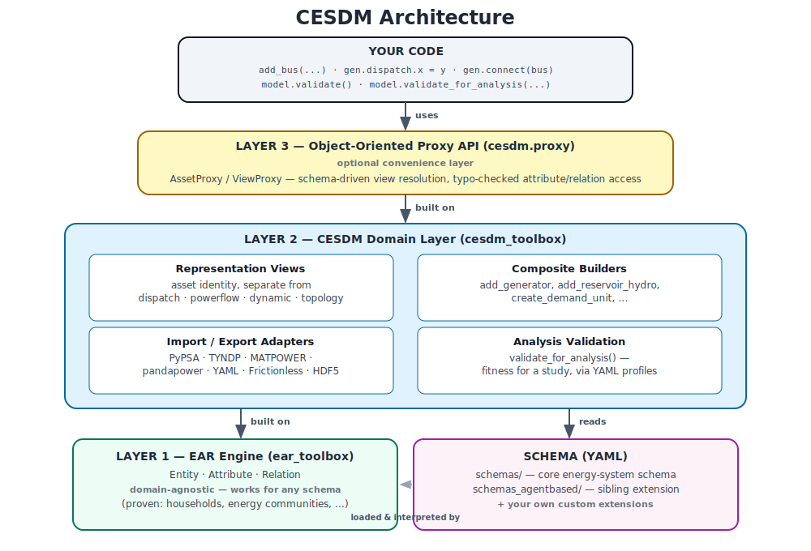

# CESDM

**CESDM — Common Energy System Domain Model** is a schema-driven toolbox for creating, exploring, validating, transforming, and exchanging interoperable energy-system models.

CESDM provides a common semantic representation that is independent of any specific optimisation, simulation, or planning tool.

> **Project status**
>
> CESDM is currently a research prototype and methodology demonstrator. The schemas and Python API are evolving and may change as the model matures.

## What CESDM provides

- A generic Entity–Attribute–Relation foundation
- Energy-system schemas defined in YAML
- Object-oriented proxy and convenience APIs
- Representation views for topology, dispatch, power flow, and other analyses
- Analysis-dependent validation profiles
- Importers and exporters for external modelling tools
- Reusable examples, tutorials, and schema references

## Start here

- [Getting started](getting_started.md)
- [What is CESDM?](guide/01_what_is_cesdm.md)
- [Core concepts](guide/02_core_concepts.md)
- [CESDM toolbox guide](guide/10_cesdm_toolbox.md)
- [Schema reference](reference/schema_reference.html)

## Architecture

